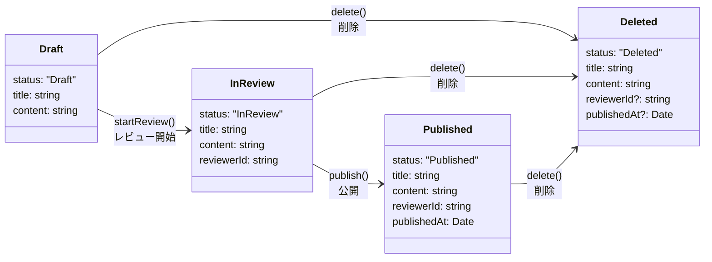

# ドメインイベントを中心にしたアプリケーション設計

[ドメインイベントを容易に記録できるコード設計を考える - kosui](https://kosui.me/posts/2025/05/06/142842)

このパッケージはドメインイベントを中心にしたコード設計の例を紹介します。

## Getting Started

```
docker compose up -d
```

```
npm install
npm run dev
```

```
open http://localhost:3000
```

## プロジェクト構成

このプロジェクトはクリーンアーキテクチャを採用しています：

- `src/domain`: エンティティ、ドメインイベント
- `src/useCase`: アプリケーションのユースケース
- `src/adaptor`: ドメインで定義されたインターフェースの実装
- `src/util`: ユーティリティ関数

## ドメインモデル

このプロジェクトは以下の概念を持つ記事管理システムを実装しています：

- **記事（Article）**: 異なる状態（下書き、レビュー中、公開済み）を持つメイン集約
- **ドメインイベント**: ArticleCreated、ArticleReviewStarted、ArticlePublished などのイベント

### 記事(Article)



### ドメインイベント

システムはすべての状態変更についてドメインイベントを記録します：

- `ArticleCreated`: 新しい記事が作成されたとき
- `ArticleReviewStarted`: 記事のレビューが開始されたとき
- `ArticlePublished`: 記事が公開されたとき

## API エンドポイント

現在のエンドポイント：

- `POST /articles/create`: 新しい記事を作成する
- `POST /articles/start-review`: 記事のレビューを開始する
- `POST /articles/publish`: 記事を公開する

## データベーススキーマ

2 つの主要なテーブル：

- `article`: 記事の現在の状態を保存
- `domain_event`: すべてのドメインイベントとそのペイロードを記録
