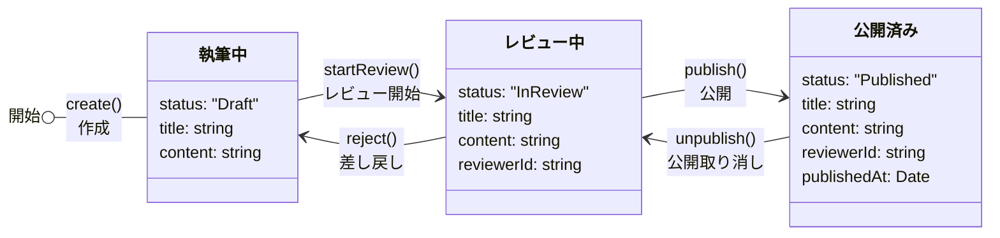

# ドメインイベントを中心にしたアプリケーション設計

[ドメインイベントを容易に記録できるコード設計を考える - kosui](https://kosui.me/posts/2025/05/06/142842)

このパッケージはドメインイベントを中心にしたコード設計の例を紹介します。

## Getting Started

```
docker compose up -d
```

```
pnpm install
pnpm dev
```

```
open http://localhost:3000
```

## 機能

### 記事管理システム

このプロジェクトは記事管理システムを提供します。

- **記事（Article）**: 異なる状態（執筆中、レビュー中、公開済み）を持つ集約



### ドメインイベント

このシステムの特徴的な点として、「作成」や「レビュー開始」などのエンティティへの変更を伴う操作をすべてデータベースへ記録します。

- `ArticleCreated`: 新しい記事が作成されたとき
- `ArticleReviewStarted`: 記事のレビューが開始されたとき
- `ArticlePublished`: 記事が公開されたとき
- `ArticleDeleted`: 記事が削除されたとき
- `ArticleRejected`: 記事が差し戻されたとき
- `ArticleUnpublished`: 記事の公開が取り消されたとき

## プロジェクト構成

- `src/domain`: エンティティ、ドメインイベント
- `src/useCase`: アプリケーションのユースケース
- `src/adaptor`: ドメインで定義されたインターフェースの実装
- `src/util`: ユーティリティ関数

## API エンドポイント

現在のエンドポイント：

- `POST /articles/create`: 新しい記事を作成する
- `POST /articles/start-review`: 記事のレビューを開始する
- `POST /articles/publish`: 記事を公開する
- `POST /articles/delete`: 記事を削除する
- `POST /articles/reject`: レビュー中の記事を差し戻す
- `POST /articles/unpublish`: 記事の公開を取り消す

## データベーススキーマ

2 つの主要なテーブル：

- `article`: 記事の現在の状態を保存
- `domain_event`: すべてのドメインイベントとそのペイロードを記録
